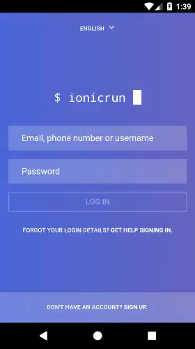

## Related post: [Creating an Instagram Login Screen with Ionic 2+](https://www.ionicrun.com/creating-an-instagram-login-screen-with-ionic-2/)

<p align="center">
  
</p>

## One time setup

Since we track some of the platform files, the initial setup requires you to first `remove` the platforms, `add` them again and `reset` (discard) the changes. The necessary steps will be discribed below.

__Important:__ if want to run the App on the __iOS simulator__, it is best to add the iOS platform in a different way or alternatively update the `ios-sim` package. There currently is a small issue with `cordova-ios@4.4.0`, which could cause an error like `Cannot read property 'replace' of undefined`, when executing the `ionic cordova run ios` command.

## Step by step

```bash
$ git clone https://github.com/ionicrun/instagram-login-screen-ionic-2.git
$ cd instagram-login-screen-ionic-2
```
Remove both platforms first
```bash
$ ionic cordova platform remove android ios
```

If any prompts show up, e.g. `[? Looks like a fresh checkout! ... ]`, answer them with `Y` (yes). Next add the platforms again and `reset` (discard) any local changes made during this process.

```bash
$ ionic cordova platform add android https://github.com/apache/cordova-ios.git#4.4.0-ios-sim

# alternative: cd platforms/ios/cordova/ && npm install ios-sim&latest

$ git reset --hard
```

## Done

You're all set! Go ahead and run the App and see the alternative splash screen in action!

```bash
$ ionic cordova run ios
# or
$ ionic cordova run android
```